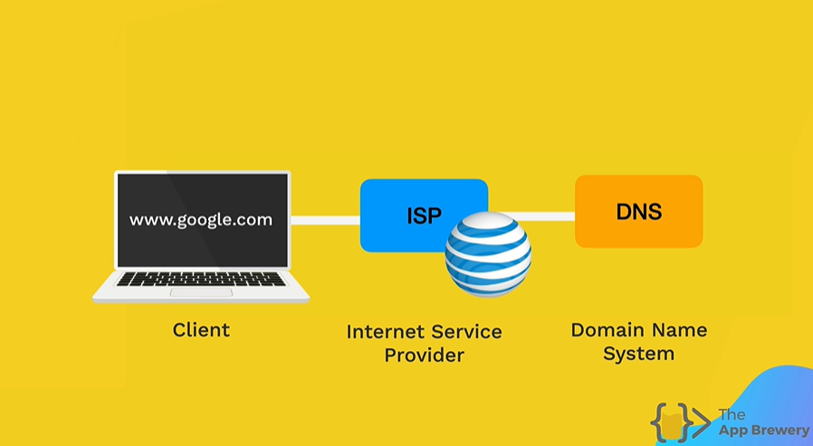
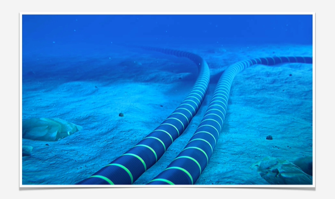
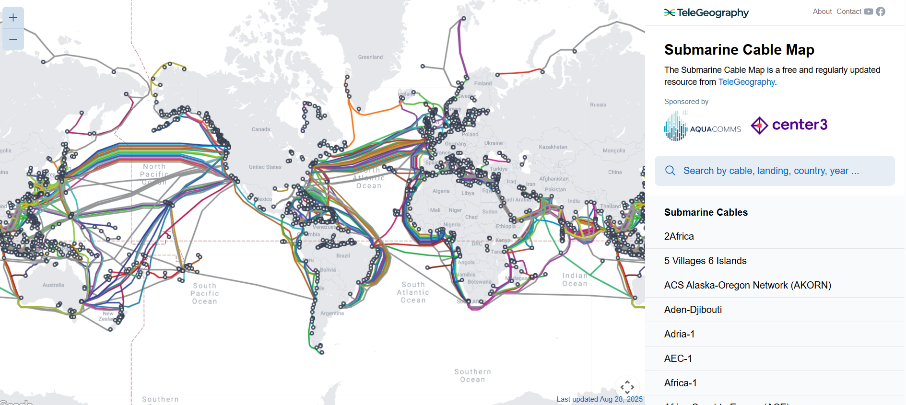

# 🌐 How Does the Internet Work?

## 1. What _is_ the Internet?

The internet is not some magical "cloud in the sky." It is much simpler:

It’s basically a giant network of **wires, cables, and computers** that are all connected together.

- Example: A computer in Belgium can "talk" to a computer in South-Africa through this network of wires.
- These wires run across countries and even under the ocean.

So the Internet is not floating in the sky—it’s very much physical and real.

---

## 2. Servers and Clients

Computers play different roles:

- **Servers** 🖥️ → Special computers that stay online 24/7. Their job is to "serve" data (like websites, images, videos).
- **Clients** 💻 (like your laptop or phone) → Devices we use to request and access data from servers.

Practical example:

- A **server** is a library (always open).
- A **client** is you, the library visitor.
- You ask for a book (website), and the librarian (server) brings it to you.

---

## 3. Finding the Right Website (The Problem)

Imagine walking into a massive library with billions of books. How do you find the one you want?

On the Internet, the same problem exists:

- When you type in `google.com`, your computer needs to know **where exactly that website lives** (its unique "address").

---

## 4. How Do We Solve This? (The Process)

So if you type `google.com` into your browser:

1. **You type:** `google.com` into Chrome/Firefox/etc.
2. **Your ISP (Internet Service Provider):**

   - This is the company you pay for Internet (e.g., Telenet, Orange and Proximus in Belgium).
   - Your request first goes to them.

3. **DNS Server (Domain Name System):**

   - This works like a phonebook.
   - You give it a name (`google.com`) and it looks up the matching **IP address** (e.g., `142.250.190.78`).

4. **Your computer gets the IP address back.**

   - Now it knows exactly where Google’s servers are.

5. **Your computer connects directly to Google’s server** using that IP address.
6. **The server sends the files back** (HTML, CSS, JavaScript, images).
7. **Your browser now displays the website!!**

---

## 5. What is an IP Address?

Every computer on the Internet has a unique address called an **IP address**.

- Example: `142.250.190.78` (Google).
- It’s like a postal code that ensures data gets to the right destination.

Try this:

- Go to [nslookup.io](https://www.nslookup.io) and type `google.com`.
- Copy the IP address you see, paste it in your browser, and watch it open Google.

---

## 6. Under the Sea 🌊 (How Continents Connect)

The Internet isn’t just within your country—it’s global.

- Different continents are connected by **undersea cables** called _submarine cables_.
- These are **fiber optic cables** that use lasers to transmit data at the speed of light.
- Each cable can carry **hundreds of gigabytes per second**.

👉 Check out [submarinecablemap.com](https://www.submarinecablemap.com) to see all the cables running under the oceans.

---

## 7. Summary

- The Internet = **wires + computers** connected worldwide.
- **Servers** store and provide information.
- **Clients** (like your laptop) request that information.
- **DNS** works like a phonebook to match website names with IP addresses.
- **Undersea cables** connect continents and carry massive amounts of data.
- All of this happens so fast, it feels instant.

---
