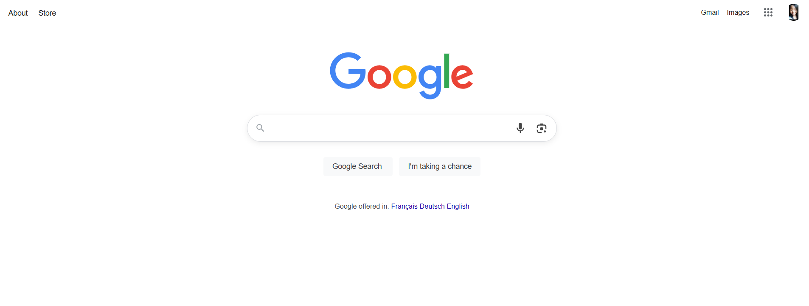

# 🌐 How Do Websites Work?

## 1. Recap: The Internet

In the previous lesson, we learned that:

- The **Internet** is just a giant network of wires connecting computers.
- **Servers** store websites and **clients** (your laptop/phone) request them.
- A **DNS server** is like a phonebook, helping your computer find the IP address of the website you typed in.

So, once your browser knows the server’s IP address, it goes there and fetches the **website files**.

---

## 2. What Files Make Up a Website?

When your browser requests a website, the server usually sends back **three main types of files**:

1. **HTML (HyperText Markup Language)** → Content

   - Think of HTML as the **bricks of a house**.
   - It’s the raw structure: text, images, links, buttons.

   Example:

   ```html
   <h1>Welcome to My Website</h1>
   <button>Click Me</button>
   ```

2. **CSS (Cascading Style Sheets)** → Style

   - CSS is like the **paint, wallpaper, and decorations** of your house.
   - It controls how things look: colors, fonts, layout, shapes.

   Example:

   ```css
   button {
     background-color: red;
     border-radius: 10px;
     font-family: Arial, sans-serif;
   }
   ```

3. **JavaScript (JS)** → Functionality

   - JavaScript is the **electricity and appliances** in your house.
   - It makes things interactive: buttons can be clicked, forms can be submitted, pages can update without reloading.

   Example:

   ```javascript
   document.querySelector("button").onclick = function () {
     alert("You clicked the button!");
   };
   ```

---

## 3. Browser’s Role 🖥️

Your browser (Chrome, Firefox, Safari, etc.) is the **translator**. It knows how to read HTML, CSS, and JS files and combine them to show you a proper website.

- First, it loads the **HTML** → you see the raw text, images, and buttons.
- Then it applies the **CSS** → everything looks styled and polished.
- Finally, it runs the **JavaScript** → now the website can actually _do_ things.

👉 Example: On **Google’s homepage**:


- **HTML** → logo, text box, and two buttons.
- **CSS** → positions the logo in the center, styles the buttons.
- **JavaScript** → lets you type in a search term, hit enter, and actually get results.

---

## 4. Try It Yourself (Inspect Tool 🔎)

Your browser comes with a hidden superpower: **Developer Tools**.

- Right-click on a page (e.g., Google’s search button).
- Click **Inspect**.
- You’ll see the HTML and CSS code for that element.

👉 Fun experiment:

- Find the button text `"Google Search"`.
- Double-click it and change it to `"Mbali Search"`.
- Press Enter → The button changes instantly on your screen! 🎉

⚠️ But notice: If you refresh the page, it goes back to normal. Why?

- Because you only changed your **local version** in your browser.
- When you refresh, your browser re-downloads the original files from the server.

This trick is fun for pranks (like changing headlines on news sites temporarily), but it doesn’t change the actual website for anyone else.

---

## 5. Big Picture Recap

- **HTML = Structure (content)**
- **CSS = Style (appearance)**
- **JavaScript = Functionality (behavior)**
- The **browser** combines all three to show you a complete website.
- Developer Tools let you peek behind the scenes and even make temporary edits.

---
