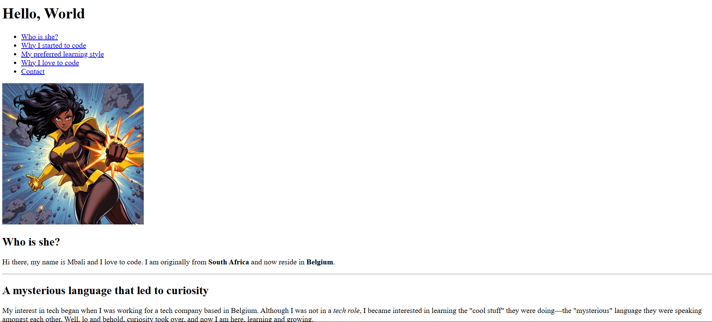

# 📄 Personal Portfolio – Mbali

A simple HTML personal portfolio page introducing myself, my background, and my journey into coding.
I built this project to learn and apply:

- Basic HTML document structure (DOCTYPE, html, head, body)
- The head section elements (title and meta)
- Text formatting elements (strong, em, b, i, u, small)
- Links (a tag, href attricute, internal/external links, anchor links)

---

## 📌 Features

- **Structured HTML5 document** with proper `<!DOCTYPE>` declaration
- **Meta tags** for SEO and responsiveness:

  - UTF-8 character encoding
  - Mobile-friendly viewport settings
  - Description for search engines

- **Navigation menu** - Anchor links used to link to different sections of the page via an ID.
- **Profile image** with descriptive `alt` text and internal style of setting the width.
- **Content sections**:

  - Each have a different text formatting style
  - Each contain an ID to link to the navigation menu
  - The last section used list items. Although this section was not part of this lesson, I couldn't have completed this portfolio page without adding my why

---

## 🚀 How to View

1. Clone or download the repository.
2. Make sure the `images/mbali.jpg` file exists and is in the correct path.
3. Open `index.html` in your browser.

---

## 🖼️ Screenshot

---

## 🛠️ Technologies Used

- **HTML5**
- Basic semantic HTML tags (`<h1>`–`<h3>`, `
`, `<ul>`, `<a>`, ``)
- Internal and external links
- Anchor links for in-page navigation

---

## 👩‍💻 About the Author

Hi! I’m **Mbali**, a passionate coder originally from **South Africa** and now based in **Belgium**.
I love solving problems, (hopefully in the future) building web applications, and breaking down challenges into structured solutions.
When I’m not coding, I’m exploring creative ways to learn, share, and grow as a developer.

📫 **Connect with me**:

- Instagram: [@mbalimade_it](https://www.instagram.com/mbalimade_it/)
- Twitter/X: [@mbalimade_it](https://x.com/mbalimade_it)

---
