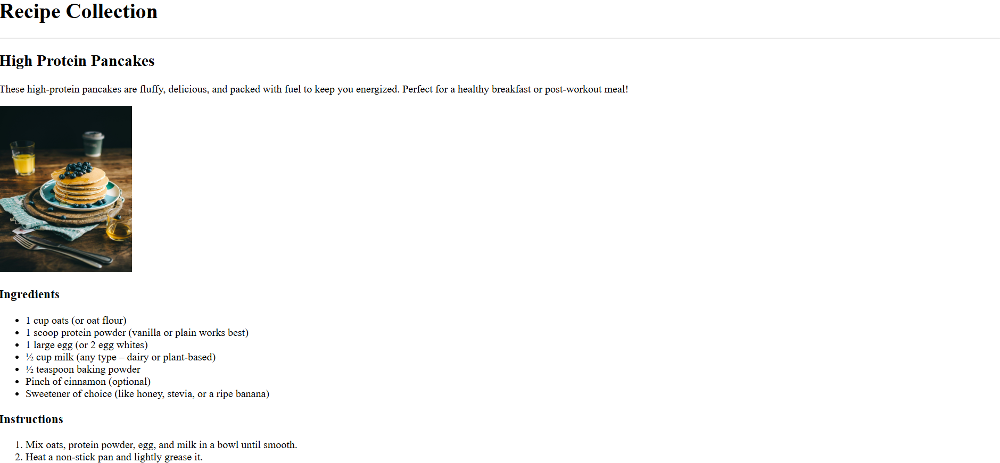

# 🍽️ Recipe Collection

A simple HTML project showcasing a collection of recipes. Each recipe includes a short description, ingredients list, step-by-step instructions, and an image. At the end, there’s a form for visitors to suggest new recipes, followed by a submit button.

I built this project to learn and apply:

- The image tag (src, alt attributes, title, width, height)
- The list element (ul, ol)
- Basic form elements (form, input, textarea, button, label)

---

## ✨ Features

- Clean and semantic **HTML structure**
- Each **recipe** contains:
  - **Image** with proper `alt` and `title` attributes
  - **Unordered lists** (`ul`) for ingredients
  - **Ordered lists** (`ol`) for instructions
- **Form** with `textarea`, `input`, and `button` for suggestions

---

## 🚀 How to View

1. Clone or download this project.
2. Make sure the all the images exists and is in the correct path.
3. Open `index.html` in your browser.
4. Browse through the recipes or try submitting a suggestion via the form (note: no backend yet).

---

## 🖼️ Screenshot

---
