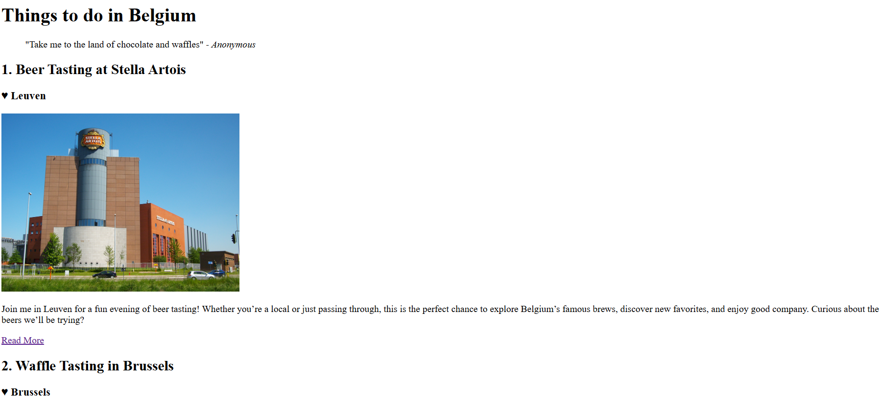

# ✍️ Blog Post Template

This multi-page blog website showcases activities you can do in Belgium. The user can click on the "read more" link to get more information about the event and then fill in the form if they would like to join the actvity.

I built this project to learn and apply:

- Linking multiple pages in html
- HTML entities and special characters
- Basic text content (blockquote, cite, q)

---

## ✨ Features

- **Preview** of the activities
- **Readmore** links to a different page with full event information
- Each **page** contains:
  - A **cited blockquote** about the location
  - Inline **quote** using `q` tag
  - Practical info section contained euro **entity**
  - A simple **form** with `input`, and `submit` to sign up

---

## 🚀 How to View

1. Clone or download the repository.
2. Make sure all folders and file exists and is in the correct path.
3. Open `index.html` in your browser.

---

## 🖼️ Screenshot

---
