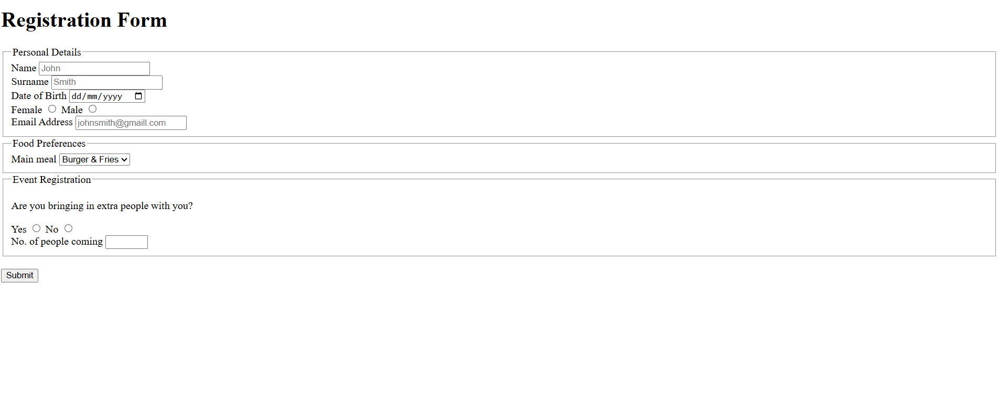

# 📝 Event Regisration Form

This event registration was form was built to advance my knowledge in HTML forms. It's a simple form that asks the person their personal details, food preferences and information about the event. Once all the details are filled in the user submits the form.

I built this project to learn and apply:

- Advanced form elements (select, option, checkbox, radio buttons)
- Form attributes (required, placeholder, min, max)
- Form validation and input types (email, date, number)

---

## ✨ Features

- Each **section** of the form is grouped by `fieldset`
- **Personal details section** includes different types of `input` `type` such as:
  - `text`
  - `radio`
  - `email`
  - `date`
- **Food preference section** includes the `select` element to give the user different food options.
- **Event registartion section** includes the `input` `type` of `radio` and `number`
  - Each user can only bring minimum 1 person and maximum 10 people. This is set by the `min` and `max` attribute

---

## 🚀 How to View

1. Clone or download the repository.
2. Open `index.html` in your browser.

---

## 🖼️ Screenshot

---
