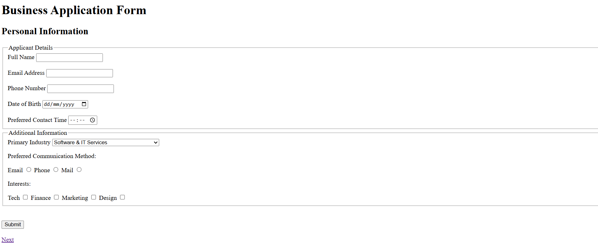

# 📝 Business Application Form

A comprehensive form with multi-step registration wizard (with just HTML) and real-time validation.

I built this project to learn and apply:

- Advanced form elements (select, option, checkbox, radio buttons)
- Form grouping (fieldset, legend, optgroup, datalist)
- Native form validation
- Input autocomplete attributes
- File inputs with accept attribute

---

## ✨ Features

- Each **section** of the form is grouped by `fieldset`
- Each **section** includes different types of `input` `type` such as:
  - `text`
  - `radio`
  - `email` - has `autocomplete` set to `email`
  - `tel` - has `autocomplete` set to `tel`
  - `date`
  - `number`
  - `url` - has `autocomplete` set to `organization`
  - `file` - only accepts .png or .pdf files
- **Additional comments section** has a `max` of 200 characters.
- Each **page** has a submit button and a link to go to the next page - this is what I did to create a **multi-step registration wizard** using just HTML

---

## 🚀 How to View

1. Clone or download the repository.
2. Open `index.html` in your browser.

---

## 🖼️ Screenshot

---
