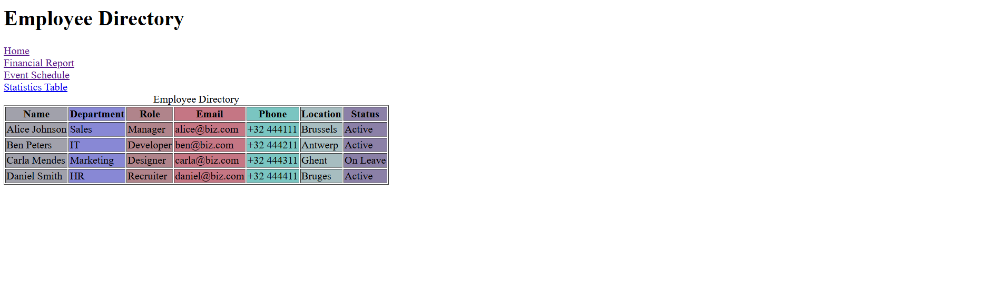

# 📊 Data Dashboard

This project is a **company data dashboard** designed to present information such as employee details, financial reports, events, and statistics in a clear and structured way.

The goal of this project was to strengthen my **HTML table skills** and explore best practices for building accessible and responsive data tables.

---

## 💡 What I Learned

Through this project, I practiced and applied:

- Basic table structure (`table`, `tr`, `td`, `th`)
- Table sections (`thead`, `tbody`, `tfoot`, `caption`)
- Column and row spanning (`colspan` and `rowspan`)
- Table accessibility (`scope` and `headers` attributes)
- Column grouping (`col` and `colgroup`)
- Responsive table techniques with HTML

---

## ✨ Features

- **General**:

  - Each table is wrapped in a responsive `
` (`overflow-x: auto;`)
  - Accessibility improved with the `scope` attribute
  - Includes a simple navigation section to jump between tables

- **Financial Report Table**:

  - Main header spans across 3 columns
  - Uses row headers for clarity

- **Employee Directory Table**:

  - Styled columns using `colgroup`

- **Event Schedule Table**:

  - Demonstrates row spanning for multiple events

- **Stats Table**:

  - Includes row headers

---

## 🚀 How to View

1. Clone or download the repository
2. Make sure all files are in the correct directory
3. Open `index.html` in your browser

---

## 🖼️ Screenshot

---

👉 This project highlights my ability to **structure, style, and optimize HTML tables** for real-world use cases while keeping accessibility and responsiveness in mind.

---
